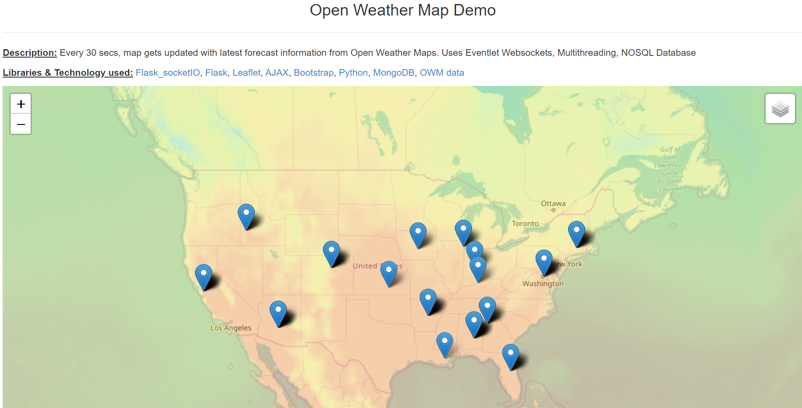

# weather_node
Python Flask-Leaflet application with Websocket, Multithreading and Database that fetches data from OpenWeatherMaps API

Download Thread fetches 5days 3 hour weather forecast corresponding to a list of given zip codes. The forecast data is saved into MongoDB collection, and is fetched by another thread which refreshes the map layers, and passes the updated marker information to client via websockets. The client receives async data and renders the data as Leaflet objects to show the map with layers and markers.

# Dependencies
`pip3 install pymongo flask flask_socketio ratelimit`

If HTTPS is not required, you may install eventlet `pip3 install eventlet` as well in order to run websockets.
